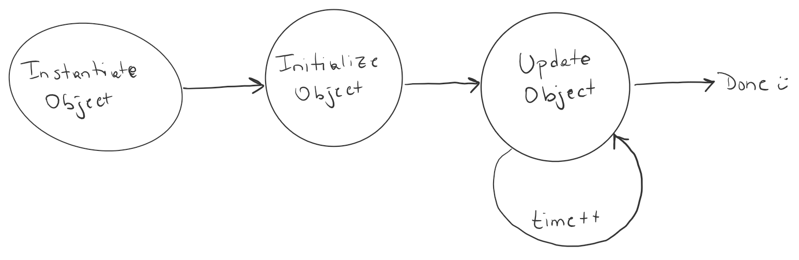

# Entry Points

_Note: this code will not compile as-provided. If you're trying to call it, we'll assume you've modified it to make it compile._

From a state-machine perspective, the code follows a simple process path.

* Instantiate a concrete `IMAlgorithm` class
* Call its `Initialize` method to establish its internal states
* Repeatedly call its `Update` method, providing new inputs as your simulation clock progress.

Like this:



## Initialize the Algorithm

You'll need a concrete `IMAlgorithm` class for this step and that choice is based on what you are trying to do. (Unsure? [Consider this.](im_clearance_types.md)) But, in general, you'll probably want to instantiate an [`IMTimeBasedAchieve`](https://github.com/mitre/im_sample_algorithm/blob/master/IntervalManagement/IMTimeBasedAchieve.cpp) or [`IMDistBasedAchieve`](https://github.com/mitre/im_sample_algorithm/blob/master/IntervalManagement/IMDistBasedAchieve.cpp) algorithm. Once that is built, you need to initialize the internal states. You'll find this declared in the parent class, [`IMKinematicAchieve.h`](https://github.com/mitre/im_sample_algorithm/blob/master/include/imalgs/IMKinematicAchieve.h).

```c++
virtual void Initialize(const KineticTrajectoryPredictor &ownship_kinetic_trajectory_predictor,
                           const KineticTrajectoryPredictor &target_kinetic_trajectory_predictor,
                           std::shared_ptr<TangentPlaneSequence> tangent_plane_sequence,
                           AircraftIntent &target_aircraft_intent,
                           const IMClearance &im_clearance,
                           const std::string &achieve_by_point,
                           WeatherPrediction &weather_prediction);
```

## Returned Data

The code provides a `virtual` declaration for the `Update` method in [IMAlgorithm.h](https://github.com/mitre/im_sample_algorithm/blob/master/include/imalgs/IMAlgorithm.h#L80).

```c++
virtual Guidance Update(const Guidance &prevguidance,
                        const DynamicsState &dynamicsstate,
                        const AircraftState &owntruthstate,
                        const AircraftState &targettruthstate,
                        const vector<AircraftState> &targethistory);
```

Each time this method is called, it is assumed that the simulation clock has advanced and new data is being provided to the algorithm. The return is a `Guidance` object. That object has [many class members](https://github.com/mitre/FMACM/blob/master/include/public/Guidance.h), but it operates as a `struct` by holding the latest value of any given member; most members are `public`. There are only two output members of importance in the Guidance object that is returned:

* `m_ias_command`: the latest speed calculated (unitized for disambiguation)
* `m_valid`: a boolean indicating if the object contains valid data

_The only output you should pay attention to are these members. All others are unused by the IMAlgorithm classes._

This output can also be accessed via a simple getter exposed by [`IMAlgorithm`](https://github.com/mitre/im_sample_algorithm/blob/master/include/imalgs/IMKinematicAchieve.h#L40):

```c++
   virtual const Units::Speed GetImSpeedCommandIas() const;
```
