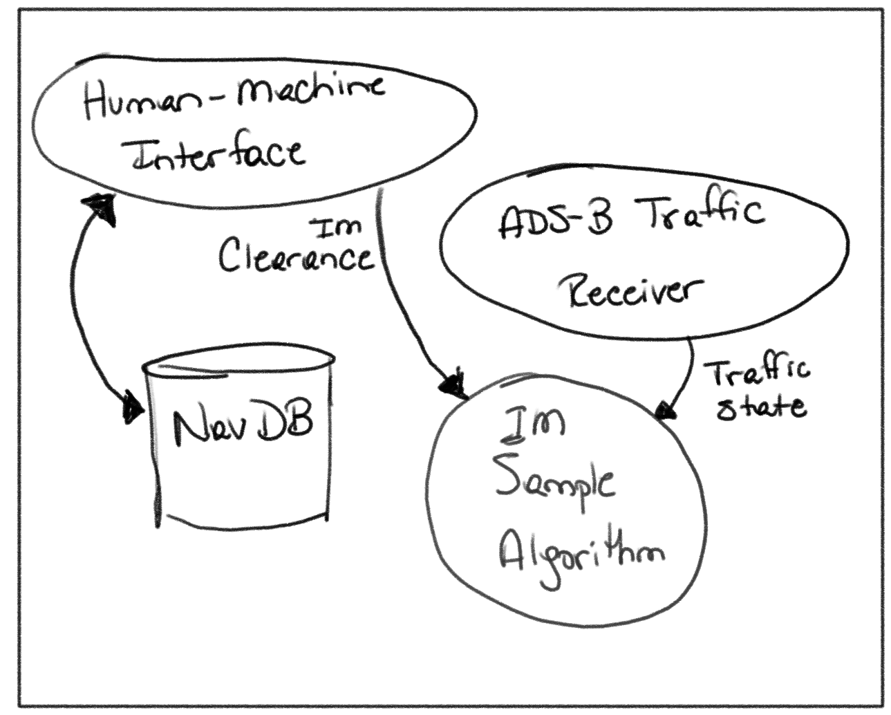

# Navigation Data Base

[Back to Landing Page](/README.md)

The [RTCA's DO-361A](https://my.rtca.org/nc__store?search=do-361) Minimum Operational Standard assumes (see Section 1.5.1) an architecture that provides a connection to a data source that conforms to the [ARINC-424 Navigation Database standard](https://en.wikipedia.org/wiki/ARINC_424). That database is assumed to provide standard navigation data including geographical locations of airports, runways, navigation fixes, and procedures. The IM Sample Algorithm discussed here does not provide the Navigation Database, nor does it provide any connection code for such a database. The database is assumed to be exterior to the IM Sample Algorithm and coordination with the database is assumed to be handled by the larger system architecture that the algorithm is a part of. 

The data format associated with the Navigation Database is not defined by this code base. However, certain data elements are essential for the algorithm to properly construct [kinematic predictions](kinematic_prediction.md) for ownship and traffic. Essential elements include the following:

* Fix Positions on the WGS84 ellipsoid
* Speed Restrictions per fix
* Altitude Restrictions per fix

These must be sequentially ordered according to the direction of flight as discussed in the [IFPI document](ifpi.md).